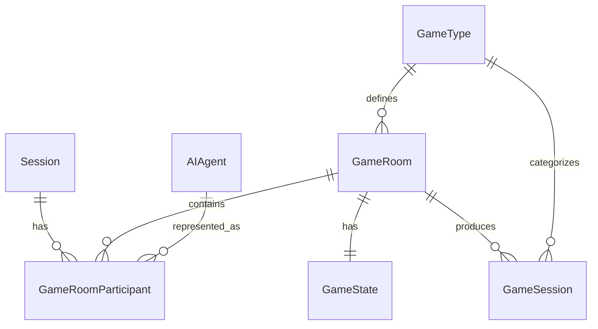

# Data Model: Backend Single User Refactor

**Branch**: 001-backend-refactor  
**Date**: 2025-11-26  
**Purpose**: Simplified data model for single-user gaming experience

## Overview

本数据模型是对现有多用户游戏模型的简化，专注于单用户与AI对手的游戏体验。主要变更包括：
1. 移除Player表，使用Session概念
2. 简化GameRoom结构，移除多用户管理
3. 保留并优化AIAgent和GameState
4. 调整GameSession为短期存储

## Entities

### Session (新增)

代表当前用户的本地会话，替代原有的Player表。

```python
class Session(Base, UUIDMixin):
    """本地用户会话，不持久化身份信息"""
    __tablename__ = "sessions"
    
    session_id: Mapped[str] = mapped_column(String(128), unique=True, nullable=False)
    created_at: Mapped[datetime] = mapped_column(default=datetime.utcnow, nullable=False)
    last_active: Mapped[datetime] = mapped_column(
        default=datetime.utcnow,
        onupdate=datetime.utcnow,
        nullable=False
    )
    expires_at: Mapped[datetime] = mapped_column(nullable=True)
    
    def is_expired(self) -> bool:
        """检查会话是否过期"""
        if self.expires_at is None:
            return False
        return datetime.utcnow() > self.expires_at
```

### GameRoom (简化)

简化的游戏房间，专为单用户体验设计。

```python
class GameRoom(Base, UUIDMixin):
    """游戏房间，简化为单用户使用"""
    __tablename__ = "game_rooms"
    
    code: Mapped[str] = mapped_column(String(8), unique=True, nullable=False)
    game_type_id: Mapped[str] = mapped_column(String(36), ForeignKey("game_types.id"), nullable=False)
    status: Mapped[str] = mapped_column(String(20), nullable=False)  # Waiting, In Progress, Completed
    max_players: Mapped[int] = mapped_column(Integer, nullable=False)
    min_players: Mapped[int] = mapped_column(Integer, nullable=False)
    
    # 移除created_by和owner字段，不需要房间所有者概念
    
    created_at: Mapped[datetime] = mapped_column(default=datetime.utcnow, nullable=False)
    started_at: Mapped[datetime | None] = mapped_column(nullable=True)
    completed_at: Mapped[datetime | None] = mapped_column(nullable=True)
    
    # AI相关字段保留
    ai_agent_counter: Mapped[int] = mapped_column(Integer, default=0, nullable=False)
    
    # 关系
    game_type: Mapped["GameType"] = relationship("GameType")
    participants: Mapped[list["GameRoomParticipant"]] = relationship(
        "GameRoomParticipant", back_populates="game_room", cascade="all, delete-orphan"
    )
    game_state: Mapped["GameState"] = relationship(
        "GameState", back_populates="game_room", uselist=False, cascade="all, delete-orphan"
    )
    sessions: Mapped[list["GameSession"]] = relationship(
        "GameSession", back_populates="game_room", cascade="all, delete-orphan"
    )
    
    def can_join(self) -> bool:
        """检查房间是否可以加入"""
        return self.status == "Waiting"
    
    def get_active_participants_count(self) -> int:
        """获取活跃参与者数量"""
        return sum(1 for p in self.participants if p.left_at is None)
    
    def is_ready_to_start(self) -> bool:
        """检查房间是否可以开始游戏"""
        return self.get_active_participants_count() >= self.min_players
    
    def increment_ai_counter(self) -> str:
        """增加AI计数器并返回AI名称"""
        self.ai_agent_counter += 1
        return f"AI玩家{self.ai_agent_counter}"
```

### GameRoomParticipant (简化)

房间参与者，区分用户会话和AI代理。

```python
class GameRoomParticipant(Base, UUIDMixin):
    """房间参与者，可以是用户会话或AI代理"""
    __tablename__ = "game_room_participants"
    
    game_room_id: Mapped[str] = mapped_column(String(36), ForeignKey("game_rooms.id", ondelete="CASCADE"), nullable=False)
    session_id: Mapped[str | None] = mapped_column(String(128), ForeignKey("sessions.id", ondelete="SET NULL"), nullable=True)
    is_ai_agent: Mapped[bool] = mapped_column(Boolean, default=False, nullable=False)
    ai_personality: Mapped[str | None] = mapped_column(String(50), nullable=True)
    joined_at: Mapped[datetime] = mapped_column(DateTime, default=datetime.utcnow, nullable=False)
    left_at: Mapped[datetime | None] = mapped_column(DateTime, nullable=True)
    
    # 移除is_owner、replaced_by_ai等复杂字段
    
    # 关系
    game_room: Mapped["GameRoom"] = relationship("GameRoom", back_populates="participants")
    session: Mapped["Session"] = relationship("Session")
    
    def is_active(self) -> bool:
        """检查参与者是否仍在游戏中"""
        return self.left_at is None
    
    def leave(self):
        """标记参与者已离开"""
        self.left_at = datetime.utcnow()
```

### AIAgent (保留并优化)

AI代理，作为用户的主要对手。

```python
class AIAgent(Base, UUIDMixin):
    """AI代理，作为游戏对手"""
    __tablename__ = "ai_agents"
    
    username: Mapped[str] = mapped_column(String(50), unique=True, nullable=False)
    personality_type: Mapped[str] = mapped_column(String(30), nullable=False)  # aggressive, defensive, balanced
    difficulty_level: Mapped[int] = mapped_column(Integer, default=1, nullable=False)  # 1-5
    is_active: Mapped[bool] = mapped_column(Boolean, default=True, nullable=False)
    created_at: Mapped[datetime] = mapped_column(default=datetime.utcnow, nullable=False)
    
    def get_decision_weights(self) -> dict:
        """根据性格类型获取决策权重"""
        weights = {
            "aggressive": {"attack": 0.7, "defend": 0.2, "special": 0.1},
            "defensive": {"attack": 0.2, "defend": 0.7, "special": 0.1},
            "balanced": {"attack": 0.4, "defend": 0.4, "special": 0.2}
        }
        return weights.get(self.personality_type, weights["balanced"])
```

### GameState (保留)

游戏状态管理，简化为单用户和AI之间的交互。

```python
class GameState(Base, UUIDMixin):
    """游戏状态，管理单用户与AI的游戏交互"""
    __tablename__ = "game_states"
    
    game_room_id: Mapped[str] = mapped_column(String(36), ForeignKey("game_rooms.id", ondelete="CASCADE"), nullable=False)
    current_turn: Mapped[str] = mapped_column(String(36), nullable=False)  # session_id或ai_agent_id
    turn_number: Mapped[int] = mapped_column(Integer, default=1, nullable=False)
    game_data: Mapped[str] = mapped_column(Text, nullable=False)  # JSON格式存储游戏特定数据
    is_paused: Mapped[bool] = mapped_column(Boolean, default=False, nullable=False)
    last_updated: Mapped[datetime] = mapped_column(default=datetime.utcnow, nullable=False)
    
    # 关系
    game_room: Mapped["GameRoom"] = relationship("GameRoom", back_populates="game_state")
    
    def advance_turn(self, next_participant_id: str):
        """推进到下一个参与者回合"""
        self.current_turn = next_participant_id
        self.turn_number += 1
        self.last_updated = datetime.utcnow()
    
    def pause_game(self):
        """暂停游戏"""
        self.is_paused = True
        self.last_updated = datetime.utcnow()
    
    def resume_game(self):
        """恢复游戏"""
        self.is_paused = False
        self.last_updated = datetime.utcnow()
```

### GameSession (调整为短期存储)

游戏会话记录，仅短期存储30天。

```python
class GameSession(Base):
    """游戏会话记录，短期存储（30天）"""
    __tablename__ = "game_sessions"
    
    id = Column(String(36), primary_key=True, default=lambda: str(uuid4()))
    
    game_room_id = Column(String(36), ForeignKey("game_rooms.id", ondelete="CASCADE"), nullable=False)
    game_type_id = Column(String(36), ForeignKey("game_types.id", ondelete="RESTRICT"), nullable=False)
    
    # 移除winner_id，因为单用户游戏中胜者总是用户或AI
    
    started_at = Column(DateTime, nullable=False)
    completed_at = Column(DateTime, nullable=False)
    duration_minutes = Column(Integer, nullable=False)
    participants_count = Column(Integer, nullable=False)
    ai_agents_count = Column(Integer, nullable=False)
    
    # 添加结果字段
    user_won: Mapped[bool] = mapped_column(Boolean, nullable=False)  # 用户是否获胜
    final_score: Mapped[int] = mapped_column(Integer, nullable=True)  # 用户最终得分
    
    # 最终游戏状态快照
    final_state = Column(Text, nullable=False)
    
    # 关系
    game_room = relationship("GameRoom", back_populates="sessions")
    game_type = relationship("GameType")
    
    @property
    def human_players_count(self) -> int:
        """计算人类玩家数量（单用户场景始终为1）"""
        return 1
```

## Entity Relationships



## Data Validation Rules

### Session Validation
- session_id必须是唯一且有效的UUID
- 会话默认24小时后过期，可扩展

### GameRoom Validation
- code必须是8位唯一字符串
- max_players必须在1-10之间
- min_players必须≤max_players且≥1

### GameRoomParticipant Validation
- 一个房间中session_id和ai_agent_id的组合必须是唯一的
- AI性格类型必须是预定义的之一
- 至少需要1个参与者才能开始游戏

### AIAgent Validation
- username必须唯一
- difficulty_level必须在1-5之间
- personality_type必须是预定义的类型之一

## State Transitions

### GameRoom State Transitions
```
Waiting → In Progress → Completed
```

### GameSession State Transitions
```
Created → Active → Completed → Archived(30天后)
```

## Data Retention Policy

- **Session**: 内存存储，不持久化，过期自动清理
- **GameRoom**: 完成后保留记录，关联GameSession
- **GameSession**: 创建后保留30天，自动清理
- **GameState**: 游戏完成后转换为最终状态存储在GameSession中

## Migration Notes

从现有多用户模型迁移到单用户模型的主要步骤：

1. 移除Player表和相关认证字段
2. 创建Session表替代Player
3. 简化GameRoom，移除owner和created_by字段
4. 更新GameRoomParticipant，使用session_id替代player_id
5. 调整GameSession，添加user_won和final_score字段
6. 实施30天数据自动清理机制

这些变更将显著简化数据模型，提高性能，同时保留核心游戏功能。