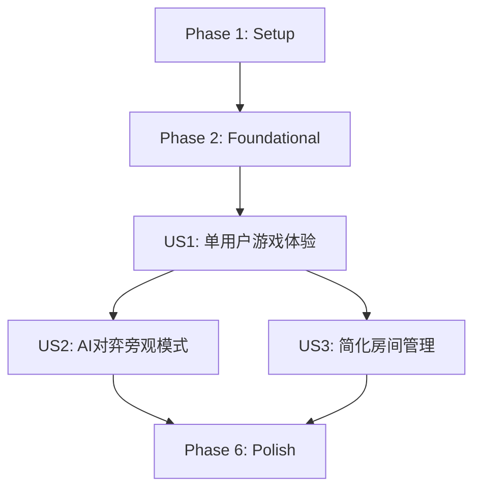

# Implementation Tasks: Backend Single User Refactor

**Branch**: 001-backend-refactor | **Date**: 2025-11-26 | **Spec**: [spec.md](spec.md)
**Source**: Implementation plan from [plan.md](plan.md), data model from [data-model.md](data-model.md), contracts from [contracts/](contracts/)

## Summary

本任务列表将后端多用户游戏平台重构为单用户游戏体验，总共包含**48个任务**，分为5个阶段：
- Phase 1: 项目设置 (7个任务)
- Phase 2: 基础组件 (10个任务)
- Phase 3: 用户故事1 - 单用户游戏体验 (11个任务)
- Phase 4: 用户故事2 - AI对弈旁观模式 (9个任务)
- Phase 5: 用户故事3 - 简化房间管理 (6个任务)
- Phase 6: 完善与跨切关注点 (5个任务)

## Task Execution Strategy

### MVP范围
用户故事1（单用户游戏体验）构成了MVP，提供核心的单用户游戏功能。Phase 3完成后，系统将具备：
- 单用户创建和管理游戏房间
- 添加AI对手
- 进行游戏

### 并行执行机会
- [P] 标记的任务可以并行执行
- 不同用户故事的任务可以由不同开发者并行处理
- 前端适配工作可以与后端开发并行进行

## Phase 1: Setup (Project Initialization)

**目标**: 设置项目环境和基本结构，使用uv管理的虚拟环境

- [ ] T001 设置uv管理的Python 3.11虚拟环境
- [ ] T002 [P] 安装核心依赖：FastAPI, SQLAlchemy, python-socketio, pytest
- [ ] T003 [P] 创建基础项目目录结构（models, services, api, websocket, tests）
- [ ] T004 配置pyproject.toml和uv依赖管理
- [ ] T005 设置SQLite数据库配置
- [ ] T006 [P] 配置开发环境：linting, formatting, pre-commit hooks
- [ ] T007 [P] 设置基本日志系统

## Phase 2: Foundational (Blocking Prerequisites)

**目标**: 实现所有用户故事共享的基础组件

- [ ] T008 创建数据库连接和会话管理
- [ ] T009 实现基础异常处理类
- [ ] T010 [P] 创建数据库模型基类和UUIDMixin
- [ ] T011 实现Session模型（替代Player）
- [ ] T012 [P] 实现GameType模型（保留现有）
- [ ] T013 创建数据库迁移脚本
- [ ] T014 [P] 设置FastAPI应用基础结构和CORS配置
- [ ] T015 实现WebSocket服务器基础设置
- [ ] T016 创建通用响应模型和错误响应格式
- [ ] T017 实现会话中间件

## Phase 3: User Story 1 - 单用户游戏体验 (Priority: P1)

**目标**: 用户能够独自创建游戏房间，与AI对手进行游戏

**独立测试标准**: 创建房间、添加AI对手、开始游戏并验证游戏流程

- [ ] T018 [US1] 实现简化后的GameRoom模型
- [ ] T019 [US1] [P] 实现GameRoomParticipant模型
- [ ] T020 [US1] 实现AIAgent模型
- [ ] T021 [US1] 实现GameState模型
- [ ] T022 [US1] [P] 创建会话API端点：POST /api/v1/sessions
- [ ] T023 [US1] 创建游戏房间API端点：POST /api/v1/rooms
- [ ] T024 [US1] [P] 实现加入房间API端点：POST /api/v1/rooms/{roomCode}/join
- [ ] T025 [US1] 创建AI代理API端点：POST /api/v1/rooms/{roomCode}/ai-agents
- [ ] T026 [US1] [P] 实现开始游戏API端点：POST /api/v1/rooms/{roomCode}/start
- [ ] T027 [US1] 实现WebSocket游戏事件：join-room, game-action, game-state-updated
- [ ] T028 [US1] [P] 实现GameRoomService核心业务逻辑

## Phase 4: User Story 2 - AI对弈旁观模式 (Priority: P2)

**目标**: 用户可以选择作为旁观者观看AI之间的对弈

**独立测试标准**: 创建AI对弈房间并设置为旁观模式

- [ ] T029 [US2] [P] 实旁观模式API端点：POST /api/v1/rooms/{roomCode}/watch
- [ ] T030 [US2] 实现GameSession模型（短期存储）
- [ ] T031 [US2] [P] 实现游戏历史API端点：GET /api/v1/sessions/{sessionId}/history
- [ ] T032 [US2] 创建旁观WebSocket事件：start-spectating, stop-spectating
- [ ] T033 [US2] [P] 实现AI决策广播事件
- [ ] T034 [US2] 实现SpectatingService业务逻辑
- [ ] T035 [US2] 创建数据清理机制（30天自动清理）
- [ ] T036 [US2] [P] 实旁观模式的UI逻辑（前端适配）
- [ ] T037 [US2] 实现AI对战初始化逻辑

## Phase 5: User Story 3 - 简化房间管理 (Priority: P2)

**目标**: 简化的房间创建和管理流程，专注于单用户体验

**独立测试标准**: 测试房间创建流程和简化的管理选项

- [ ] T038 [US3] [P] 实现获取房间列表API端点：GET /api/v1/rooms
- [ ] T039 [US3] 实现获取房间详情API端点：GET /api/v1/rooms/{roomCode}
- [ ] T040 [US3] [P] 实现离开房间API端点：POST /api/v1/rooms/{roomCode}/leave
- [ ] T041 [US3] 实现删除房间API端点：DELETE /api/v1/rooms/{roomCode}
- [ ] T042 [US3] [P] 实现移除AI代理API端点：DELETE /api/v1/rooms/{roomCode}/ai-agents/{agentId}
- [ ] T043 [US3] 实现房间状态管理服务

## Phase 6: Polish & Cross-Cutting Concerns

**目标**: 完善系统性能、可观测性和文档

- [ ] T044 [P] 实现API性能优化：响应缓存和查询优化
- [ ] T045 [P] 添加结构化日志和监控指标
- [ ] T046 [P] 实现健康检查端点：GET /api/v1/health
- [ ] T047 [P] 完善API文档（Swagger UI集成）
- [ ] T048 实现全面测试套件（单元、集成和契约测试）

## Dependencies

### 用户故事完成顺序


### 关键依赖路径
1. Phase 1 → Phase 2 → Phase 3 → Phase 6
2. Phase 3 必须在 Phase 4 和 Phase 5 之前完成
3. Phase 4 和 Phase 5 可以并行开发
4. 所有用户故事完成后才能进行 Phase 6

## Parallel Execution Examples

### 用户故事1内部并行
```bash
# 开发者A
- T018 实现GameRoom模型
- T022 创建会话API端点
- T025 创建AI代理API端点
- T027 实现WebSocket游戏事件

# 开发者B
- T019 实现GameRoomParticipant模型
- T020 实现AIAgent模型
- T021 实现GameState模型
- T024 实现加入房间API端点
```

### 后端与前端并行
```bash
# 后端开发
- T018-T028 实现单用户游戏API

# 前端开发（并行）
- 适配新的API端点
- 更新WebSocket事件处理
- 实现单用户UI流程
```

## Implementation Strategy

### MVP第一 (用户故事1)
1. 首先实现单用户游戏体验（Phase 1-3）
2. 提供基本的游戏创建、AI对手添加和游戏进行功能
3. 优先确保核心游戏流程可用

### 渐进式交付
1. 用户故事1完成后，可部署基本的单用户游戏版本
2. 然后添加旁观功能（用户故事2）
3. 最后完善房间管理功能（用户故事3）
4. 通过性能优化和完善收尾（Phase 6）

### 测试策略
1. 单元测试覆盖所有模型和服务
2. 集成测试验证API端点
3. 契约测试确保API一致性
4. 性能测试验证响应时间提升50%的目标

## Success Metrics

- **代码减少**: 移除多用户相关代码，总代码行数减少30%以上
- **API精简**: 端点数量减少至少40%
- **性能提升**: 响应时间提高50%
- **用户体验**: 用户可以在30秒内创建游戏并开始
- **游戏启动**: 启动时间减少到5秒以内

## Notes

- 所有任务必须遵循代码质量标准和审查流程
- 每个API端点需要适当的错误处理和验证
- 确保使用uv管理的虚拟环境进行开发
- 所有数据库操作必须在事务中执行
- WebSocket连接需要适当的错误处理和重连逻辑