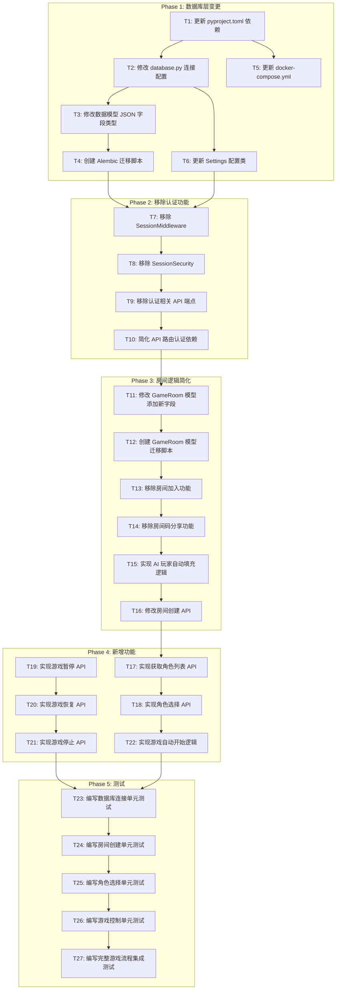

# VBRPG 单人游戏模式 - 任务清单

## 任务依赖关系图

## 任务详情

### Phase 1: 数据库层变更

#### T1: 更新 pyproject.toml 依赖
- **文件**: `backend/pyproject.toml`
- **操作**: 
  - 移除 `aiosqlite>=0.19.0`
  - 新增 `aiomysql>=0.2.0`
  - 新增 `cryptography>=41.0.0`

#### T2: 修改 database.py 连接配置
- **文件**: `backend/src/database.py`
- **操作**:
  - 移除 `NullPool` 导入和配置
  - 移除 `check_same_thread` 参数
  - 配置 MySQL 连接池参数（pool_size、max_overflow、pool_recycle）
  - 移除 `init_db` 中的 SQLite PRAGMA 语句

#### T3: 修改数据模型 JSON 字段类型
- **文件**: 
  - `backend/src/models/game.py`
  - `backend/src/models/user.py`
- **操作**:
  - `GameState.game_data`: Text → JSON
  - `GameSession.final_state`: Text → JSON
  - `PlayerProfile.ui_preferences`: Text → JSON
  - 导入 `sqlalchemy.dialects.mysql.JSON`

#### T4: 创建 Alembic 迁移脚本
- **文件**: `backend/alembic/versions/` 新建迁移文件
- **操作**:
  - 生成 MySQL 兼容的表结构迁移脚本
  - 处理 JSON 字段类型转换

#### T5: 更新 docker-compose.yml
- **文件**: `docker-compose.yml`
- **操作**:
  - 新增 MySQL 8.0 服务配置
  - 新增 mysql_data 卷
  - 修改 backend 的 DATABASE_URL 环境变量

#### T6: 更新 Settings 配置类
- **文件**: `backend/src/utils/config.py`
- **操作**:
  - 修改 DATABASE_URL 默认值格式为 MySQL

---

### Phase 2: 移除认证功能

#### T7: 移除 SessionMiddleware
- **文件**: `backend/src/utils/config.py`
- **操作**:
  - 删除 `SessionMiddleware` 类

#### T8: 移除 SessionSecurity
- **文件**: `backend/src/utils/config.py`
- **操作**:
  - 删除 `SessionSecurity` 类
  - 删除 `session_security` 全局实例

#### T9: 移除认证相关 API 端点
- **文件**: `backend/src/api/user_routes.py`
- **操作**:
  - 移除注册端点
  - 移除登录端点
  - 移除登出端点

#### T10: 简化 API 路由认证依赖
- **文件**: 
  - `backend/src/api/game_routes.py`
  - `backend/src/api/user_routes.py`
- **操作**:
  - 移除所有 API 端点的认证依赖注入
  - 移除 X-Session-ID 头部验证

---

### Phase 3: 房间逻辑简化

#### T11: 修改 GameRoom 模型添加新字段
- **文件**: `backend/src/models/game.py`
- **操作**:
  - 新增 `user_role: String(50)` 字段
  - 新增 `is_spectator_mode: Boolean` 字段
  - 移除 `owner_id` 字段
  - 移除 `created_by` 字段

#### T12: 创建 GameRoom 模型迁移脚本
- **文件**: `backend/alembic/versions/` 新建迁移文件
- **操作**:
  - 添加 user_role 列
  - 添加 is_spectator_mode 列
  - 移除 owner_id 列
  - 移除 created_by 列

#### T13: 移除房间加入功能
- **文件**: `backend/src/services/game_room_service.py`
- **操作**:
  - 删除 `join_room` 方法
  - 删除相关的房间容量检查逻辑

#### T14: 移除房间码分享功能
- **文件**: `backend/src/api/game_routes.py`
- **操作**:
  - 删除 `/rooms/{code}/join` 端点
  - 删除 `/rooms/{code}/share` 端点（如存在）

#### T15: 实现 AI 玩家自动填充逻辑
- **文件**: `backend/src/services/game_room_service.py`
- **操作**:
  - 新增 `fill_ai_players` 方法
  - 根据 GameType 的玩家数量配置自动创建 AI 参与者

#### T16: 修改房间创建 API
- **文件**: 
  - `backend/src/api/game_routes.py`
  - `backend/src/api/schemas.py`
- **操作**:
  - 修改 POST `/api/rooms` 端点
  - 移除认证要求
  - 简化请求参数

---

### Phase 4: 新增功能

#### T17: 实现获取角色列表 API
- **文件**: 
  - `backend/src/api/game_routes.py`
  - `backend/src/api/schemas.py`
- **操作**:
  - 新增 GET `/api/games/{game_type}/roles` 端点
  - 返回游戏类型可选角色列表

#### T18: 实现角色选择 API
- **文件**: 
  - `backend/src/api/game_routes.py`
  - `backend/src/api/schemas.py`
  - `backend/src/services/game_room_service.py`
- **操作**:
  - 新增 POST `/api/rooms/{code}/select-role` 端点
  - 支持选择旁观者或参与角色
  - 选择后锁定不可更改

#### T19: 实现游戏暂停 API
- **文件**: 
  - `backend/src/api/game_routes.py`
  - `backend/src/services/game_state_service.py`
- **操作**:
  - 新增 POST `/api/games/{room_code}/pause` 端点
  - 调用 GameState.pause_game() 方法

#### T20: 实现游戏恢复 API
- **文件**: 
  - `backend/src/api/game_routes.py`
  - `backend/src/services/game_state_service.py`
- **操作**:
  - 新增 POST `/api/games/{room_code}/resume` 端点
  - 调用 GameState.resume_game() 方法

#### T21: 实现游戏停止 API
- **文件**: 
  - `backend/src/api/game_routes.py`
  - `backend/src/services/game_state_service.py`
- **操作**:
  - 新增 POST `/api/games/{room_code}/stop` 端点
  - 结束游戏，设置房间状态为 Completed

#### T22: 实现游戏自动开始逻辑
- **文件**: `backend/src/services/game_room_service.py`
- **操作**:
  - 在角色选择确认后自动触发游戏开始
  - 调用 AI 填充逻辑
  - 初始化游戏状态

---

### Phase 5: 测试

#### T23: 编写数据库连接单元测试
- **文件**: `backend/tests/unit/test_database.py`
- **操作**:
  - 测试 MySQL 连接配置
  - 测试连接池功能
  - 测试 JSON 字段读写

#### T24: 编写房间创建单元测试
- **文件**: `backend/tests/unit/test_game_room_service.py`
- **操作**:
  - 测试房间创建（无认证）
  - 测试 AI 玩家自动填充
  - 测试房间状态管理

#### T25: 编写角色选择单元测试
- **文件**: `backend/tests/unit/test_role_selection.py`
- **操作**:
  - 测试获取角色列表
  - 测试选择参与角色
  - 测试选择旁观者模式
  - 测试选择后锁定

#### T26: 编写游戏控制单元测试
- **文件**: `backend/tests/unit/test_game_control.py`
- **操作**:
  - 测试暂停功能
  - 测试恢复功能
  - 测试停止功能

#### T27: 编写完整游戏流程集成测试
- **文件**: `backend/tests/integration/test_singleplayer_flow.py`
- **操作**:
  - 测试完整单人游戏流程
  - 测试旁观者模式完整流程
  - 测试暂停/恢复/停止完整流程

## 任务执行顺序

1. T1 → T2 → T3 → T4（数据库核心变更）
2. T1 → T5（并行：Docker 配置）
3. T2 → T6（并行：Settings 配置）
4. T7 → T8 → T9 → T10（移除认证）
5. T11 → T12 → T13 → T14 → T15 → T16（房间逻辑）
6. T17 → T18 → T22（角色选择和自动开始）
7. T19 → T20 → T21（游戏控制）
8. T23 → T24 → T25 → T26 → T27（测试）
