# 狼人杀游戏交互增强 - 任务清单

## 任务依赖关系图

```mermaid
flowchart TB
    subgraph Phase1["Phase 1: 后端数据模型"]
        B1["B1: 扩展 WerewolfGameState 数据类<br/>添加 is_paused, is_started 等字段"]
        B2["B2: 新增 GameLogEntry 数据类<br/>定义日志条目结构"]
    end

    subgraph Phase2["Phase 2: 主持人公告增强"]
        B3["B3: 新增 request_speech Prompt 模板"]
        B4["B4: 实现 announce_request_speech 方法"]
        B5["B5: 实现 announce_player_speech_end 方法"]
    end

    subgraph Phase3["Phase 3: 游戏控制核心"]
        B6["B6: 实现 start_game_manual 方法"]
        B7["B7: 实现 pause_game 方法"]
        B8["B8: 实现 resume_game 方法"]
        B9["B9: 实现 _check_paused_before_next_action"]
    end

    subgraph Phase4["Phase 4: 主持人公告广播"]
        B10["B10: 实现 _broadcast_host_announcement 方法"]
    end

    subgraph Phase5["Phase 5: 讨论流程实现"]
        B11["B11: 实现 _execute_discussion_phase 方法"]
        B12["B12: 实现 _request_player_speech 方法"]
        B13["B13: 实现 _wait_for_human_speech 方法"]
        B14["B14: 实现 _send_speech_reminder 方法"]
    end

    subgraph Phase6["Phase 6: 玩家发言与上下文"]
        B15["B15: 实现 process_player_speech 方法"]
        B16["B16: 实现 _build_ai_context 方法"]
        B17["B17: AI Agent 增加 update_context 方法"]
        B18["B18: AI Agent 增强 generate_speech_stream"]
    end

    subgraph Phase7["Phase 7: WebSocket 事件处理"]
        B19["B19: 新增 werewolf_start_game 处理器"]
        B20["B20: 新增 werewolf_pause_game 处理器"]
        B21["B21: 新增 werewolf_resume_game 处理器"]
        B22["B22: 新增 werewolf_player_speech 处理器"]
        B23["B23: 增强 host_announcement 事件结构"]
    end

    subgraph Phase8["Phase 8: REST API"]
        B24["B24: 新增 GET /rooms/{code}/logs API"]
    end

    subgraph Phase9["Phase 9: 前端状态管理"]
        F1["F1: game store 新增游戏控制状态"]
        F2["F2: game store 新增主持人公告状态"]
        F3["F3: game store 新增发言气泡状态"]
        F4["F4: game store 新增日志级别状态"]
        F5["F5: socket store 新增游戏控制事件监听"]
        F6["F6: socket store 新增主持人公告事件监听"]
        F7["F7: socket store 新增发言相关事件监听"]
        F8["F8: socket store 新增事件发送方法"]
    end

    subgraph Phase10["Phase 10: 前端组件 - 游戏控制"]
        F9["F9: 创建 GameControlBar 组件模板"]
        F10["F10: 实现 GameControlBar 逻辑"]
        F11["F11: 实现 GameControlBar 样式"]
    end

    subgraph Phase11["Phase 11: 前端组件 - 主持人面板"]
        F12["F12: 创建 HostAnnouncementPanel 组件模板"]
        F13["F13: 实现 HostAnnouncementPanel 打字机效果"]
        F14["F14: 实现 HostAnnouncementPanel 历史折叠"]
        F15["F15: 实现 HostAnnouncementPanel 样式"]
    end

    subgraph Phase12["Phase 12: 前端组件 - 发言气泡"]
        F16["F16: 创建 SpeechBubble 组件模板"]
        F17["F17: 实现 SpeechBubble 流式显示逻辑"]
        F18["F18: 实现 SpeechBubble 自动消失逻辑"]
        F19["F19: 实现 SpeechBubble 位置计算"]
        F20["F20: 实现 SpeechBubble 样式与动画"]
    end

    subgraph Phase13["Phase 13: 前端组件 - 玩家输入"]
        F21["F21: 创建 PlayerInputBar 组件模板"]
        F22["F22: 实现 PlayerInputBar 输入逻辑"]
        F23["F23: 实现 PlayerInputBar 禁用状态"]
        F24["F24: 实现 PlayerInputBar 发言提醒"]
        F25["F25: 实现 PlayerInputBar 样式"]
    end

    subgraph Phase14["Phase 14: 前端组件 - 组件增强"]
        F26["F26: PlayerSeat 集成 SpeechBubble"]
        F27["F27: PlayerSeat 增加发言状态动画"]
        F28["F28: GameLog 新增日志级别切换UI"]
        F29["F29: GameLog 实现日志过滤逻辑"]
        F30["F30: GameLog 新增主持人公告样式"]
        F31["F31: GameLog 新增玩家发言样式"]
        F32["F32: GameLog 实现自动滚动"]
    end

    subgraph Phase15["Phase 15: 视图集成"]
        F33["F33: WerewolfGameView 集成 GameControlBar"]
        F34["F34: WerewolfGameView 集成 HostAnnouncementPanel"]
        F35["F35: WerewolfGameView 集成 PlayerInputBar"]
        F36["F36: WerewolfGameView 布局调整"]
    end

    subgraph Phase16["Phase 16: 断线重连"]
        F37["F37: 实现重连后请求日志 API"]
        F38["F38: 实现历史日志回放"]
        F39["F39: 实现主持人公告历史恢复"]
        F40["F40: 实现当前状态恢复"]
    end

    subgraph Phase17["Phase 17: 后端单元测试"]
        T1["T1: 测试 WerewolfGameState 新字段"]
        T2["T2: 测试 start_game_manual"]
        T3["T3: 测试 pause_game/resume_game"]
        T4["T4: 测试 process_player_speech"]
        T5["T5: 测试 _build_ai_context"]
        T6["T6: 测试主持人公告生成"]
    end

    subgraph Phase18["Phase 18: 前端单元测试"]
        T7["T7: 测试 GameControlBar 组件"]
        T8["T8: 测试 HostAnnouncementPanel 组件"]
        T9["T9: 测试 SpeechBubble 组件"]
        T10["T10: 测试 PlayerInputBar 组件"]
        T11["T11: 测试 GameLog 日志级别切换"]
        T12["T12: 测试 game store 新状态"]
    end

    subgraph Phase19["Phase 19: 集成测试"]
        T13["T13: 测试完整游戏开始流程"]
        T14["T14: 测试暂停继续流程"]
        T15["T15: 测试玩家发言交互流程"]
        T16["T16: 测试断线重连恢复"]
    end

    %% Phase 1 -> Phase 2
    B1 --> B3
    B2 --> B10

    %% Phase 2 内部
    B3 --> B4
    B4 --> B5

    %% Phase 1 -> Phase 3
    B1 --> B6
    B1 --> B7
    B1 --> B8

    %% Phase 3 内部
    B7 --> B9
    B8 --> B9

    %% Phase 2,3 -> Phase 4
    B4 --> B10
    B5 --> B10
    B6 --> B10

    %% Phase 4 -> Phase 5
    B10 --> B11
    B9 --> B11
    B11 --> B12
    B12 --> B13
    B13 --> B14

    %% Phase 5 -> Phase 6
    B12 --> B15
    B13 --> B15
    B15 --> B16
    B16 --> B17
    B17 --> B18

    %% Phase 3,4,5,6 -> Phase 7
    B6 --> B19
    B7 --> B20
    B8 --> B21
    B15 --> B22
    B10 --> B23

    %% Phase 1 -> Phase 8
    B2 --> B24

    %% Phase 7,8 -> Phase 9
    B19 --> F1
    B20 --> F1
    B21 --> F1
    B23 --> F2
    B22 --> F3
    B24 --> F4
    F1 --> F5
    F2 --> F6
    F3 --> F7
    F5 --> F8
    F6 --> F8
    F7 --> F8

    %% Phase 9 -> Phase 10
    F1 --> F9
    F9 --> F10
    F10 --> F11

    %% Phase 9 -> Phase 11
    F2 --> F12
    F12 --> F13
    F13 --> F14
    F14 --> F15

    %% Phase 9 -> Phase 12
    F3 --> F16
    F16 --> F17
    F17 --> F18
    F18 --> F19
    F19 --> F20

    %% Phase 9 -> Phase 13
    F7 --> F21
    F21 --> F22
    F22 --> F23
    F23 --> F24
    F24 --> F25

    %% Phase 10,11,12,13 -> Phase 14
    F20 --> F26
    F26 --> F27
    F4 --> F28
    F28 --> F29
    F6 --> F30
    F30 --> F31
    F31 --> F32

    %% Phase 10,11,13,14 -> Phase 15
    F11 --> F33
    F15 --> F34
    F25 --> F35
    F32 --> F36
    F33 --> F36
    F34 --> F36
    F35 --> F36

    %% Phase 8,9,15 -> Phase 16
    B24 --> F37
    F8 --> F37
    F36 --> F37
    F37 --> F38
    F38 --> F39
    F39 --> F40

    %% Phase 1-8 -> Phase 17
    B1 --> T1
    B6 --> T2
    B7 --> T3
    B8 --> T3
    B15 --> T4
    B16 --> T5
    B10 --> T6

    %% Phase 10-14 -> Phase 18
    F11 --> T7
    F15 --> T8
    F20 --> T9
    F25 --> T10
    F29 --> T11
    F8 --> T12

    %% Phase 15,16,17,18 -> Phase 19
    F40 --> T13
    T3 --> T14
    T4 --> T15
    F40 --> T16
```

---

## 任务详情

### Phase 1: 后端数据模型

#### B1: 扩展 WerewolfGameState 数据类
- **文件**: `backend/src/services/games/werewolf_engine.py`
- **描述**: 在 `WerewolfGameState` 数据类中添加以下字段:
  - `is_paused: bool = False`
  - `is_started: bool = False`
  - `current_speaker_seat: int | None = None`
  - `waiting_for_player_input: bool = False`
  - `speech_reminder_count: int = 0`
- **验收**: 数据类能正确初始化和序列化新字段

#### B2: 新增 GameLogEntry 数据类
- **文件**: `backend/src/services/games/werewolf_engine.py`
- **描述**: 新建 `GameLogEntry` 数据类，包含:
  - `id: str`
  - `type: str` (speech, host_announcement, death, vote, skill)
  - `content: str`
  - `day: int`
  - `phase: str`
  - `time: datetime`
  - `player_id: str | None`
  - `player_name: str | None`
  - `seat_number: int | None`
  - `metadata: dict | None`
  - `is_public: bool = True`
- **验收**: 能创建日志条目实例并序列化为字典

---

### Phase 2: 主持人公告增强

#### B3: 新增 request_speech Prompt 模板
- **文件**: `backend/src/services/ai_agents/host/host_prompts.py`
- **描述**: 添加 `request_speech` 和 `speech_end_transition` Prompt 模板
- **验收**: Prompt 模板存在且格式正确

#### B4: 实现 announce_request_speech 方法
- **文件**: `backend/src/services/ai_agents/host/werewolf_host.py`
- **描述**: 实现主持人点名玩家发言的公告方法，支持流式输出
- **参数**: `seat_number`, `player_name`, `is_human`, `stream`
- **验收**: 调用后能流式返回点名公告内容

#### B5: 实现 announce_player_speech_end 方法
- **文件**: `backend/src/services/ai_agents/host/werewolf_host.py`
- **描述**: 实现主持人确认玩家发言结束的简短公告
- **验收**: 返回简短的发言结束确认文本

---

### Phase 3: 游戏控制核心

#### B6: 实现 start_game_manual 方法
- **文件**: `backend/src/services/werewolf_game_service.py`
- **描述**: 实现手动开始游戏方法
- **流程**:
  1. 验证房间状态
  2. 设置 `is_started = True`
  3. 初始化游戏状态
  4. 创建 AI Agents
- **验收**: 调用后游戏状态正确初始化

#### B7: 实现 pause_game 方法
- **文件**: `backend/src/services/werewolf_game_service.py`
- **描述**: 实现暂停游戏方法
- **流程**:
  1. 验证游戏进行中
  2. 设置 `is_paused = True`
- **验收**: 调用后 `is_paused` 为 True

#### B8: 实现 resume_game 方法
- **文件**: `backend/src/services/werewolf_game_service.py`
- **描述**: 实现继续游戏方法
- **流程**:
  1. 验证游戏已暂停
  2. 设置 `is_paused = False`
- **验收**: 调用后 `is_paused` 为 False

#### B9: 实现 _check_paused_before_next_action
- **文件**: `backend/src/services/werewolf_game_service.py`
- **描述**: 实现在下一个行动前检查暂停状态的内部方法
- **流程**: 如果 `is_paused` 为 True，循环等待直到变为 False
- **验收**: 暂停时方法阻塞，继续后方法返回

---

### Phase 4: 主持人公告广播

#### B10: 实现 _broadcast_host_announcement 方法
- **文件**: `backend/src/services/werewolf_game_service.py`
- **描述**: 实现主持人公告广播方法（流式）
- **流程**:
  1. 调用 WerewolfHost 生成公告
  2. 发送 `werewolf:host_announcement_start` 事件
  3. 循环发送 `werewolf:host_announcement_chunk` 事件
  4. 发送 `werewolf:host_announcement_end` 事件
  5. 创建 GameLogEntry 记录到日志
- **验收**: 公告能流式广播并记录到日志

---

### Phase 5: 讨论流程实现

#### B11: 实现 _execute_discussion_phase 方法
- **文件**: `backend/src/services/werewolf_game_service.py`
- **描述**: 实现讨论阶段主流程（主持人主导）
- **流程**:
  1. 广播讨论开始公告
  2. 获取存活玩家列表
  3. 依次调用 `_request_player_speech`
  4. 广播发言结束公告
- **验收**: 能按顺序执行讨论流程

#### B12: 实现 _request_player_speech 方法
- **文件**: `backend/src/services/werewolf_game_service.py`
- **描述**: 实现主持人点名玩家发言
- **流程**:
  1. 广播点名公告
  2. 发送 `werewolf:request_speech` 事件
  3. 设置 `current_speaker_seat`
  4. 根据是否人类玩家选择等待或触发 AI 发言
- **验收**: 点名后正确设置状态并通知前端

#### B13: 实现 _wait_for_human_speech 方法
- **文件**: `backend/src/services/werewolf_game_service.py`
- **描述**: 实现等待人类玩家发言（无超时）
- **流程**:
  1. 设置 `waiting_for_player_input = True`
  2. 启动提醒任务
  3. 使用 asyncio.Event 等待发言
  4. 返回发言内容
- **验收**: 能无限等待玩家发言并接收

#### B14: 实现 _send_speech_reminder 方法
- **文件**: `backend/src/services/werewolf_game_service.py`
- **描述**: 实现定时发言提醒（每30秒）
- **流程**:
  1. 递增 `speech_reminder_count`
  2. 发送 `werewolf:speech_reminder` 事件
- **验收**: 能按时发送提醒事件

---

### Phase 6: 玩家发言与上下文

#### B15: 实现 process_player_speech 方法
- **文件**: `backend/src/services/werewolf_game_service.py`
- **描述**: 处理玩家发言
- **流程**:
  1. 验证是否轮到该玩家发言
  2. 创建 GameLogEntry 记录发言
  3. 广播 `werewolf:speech_end` 事件
  4. 设置 `waiting_for_player_input = False`
  5. 触发发言等待的 Event
- **验收**: 发言能被正确处理和广播

#### B16: 实现 _build_ai_context 方法
- **文件**: `backend/src/services/werewolf_game_service.py`
- **描述**: 为 AI Agent 构建上下文
- **内容**:
  - 游戏历史日志
  - 当天所有公开发言
  - 主持人公告摘要
  - 存活玩家信息
  - 本轮已有发言
- **验收**: 返回结构化的上下文字典

#### B17: AI Agent 增加 update_context 方法
- **文件**: `backend/src/services/ai_agents/base.py`
- **描述**: 在 AI Agent 基类中添加 `update_context` 方法
- **参数**: `speeches: list[dict]`
- **验收**: 所有 Agent 子类能调用该方法更新上下文

#### B18: AI Agent 增强 generate_speech_stream
- **文件**: `backend/src/services/ai_agents/*.py`
- **描述**: 增强发言生成方法，增加参数:
  - `current_round_speeches: list[dict]`
  - `host_context: str | None`
- **验收**: AI 发言能考虑玩家发言上下文

---

### Phase 7: WebSocket 事件处理

#### B19: 新增 werewolf_start_game 处理器
- **文件**: `backend/src/websocket/werewolf_handlers.py`
- **描述**: 处理开始游戏事件
- **流程**: 调用 `WerewolfGameService.start_game_manual()`
- **验收**: 收到事件后能触发游戏开始

#### B20: 新增 werewolf_pause_game 处理器
- **文件**: `backend/src/websocket/werewolf_handlers.py`
- **描述**: 处理暂停游戏事件
- **流程**: 调用 `WerewolfGameService.pause_game()`，广播 `werewolf:game_paused`
- **验收**: 收到事件后能暂停游戏

#### B21: 新增 werewolf_resume_game 处理器
- **文件**: `backend/src/websocket/werewolf_handlers.py`
- **描述**: 处理继续游戏事件
- **流程**: 调用 `WerewolfGameService.resume_game()`，广播 `werewolf:game_resumed`
- **验收**: 收到事件后能继续游戏

#### B22: 新增 werewolf_player_speech 处理器
- **文件**: `backend/src/websocket/werewolf_handlers.py`
- **描述**: 处理玩家发言事件
- **流程**: 调用 `WerewolfGameService.process_player_speech()`
- **验收**: 收到事件后能处理发言

#### B23: 增强 host_announcement 事件结构
- **文件**: `backend/src/websocket/werewolf_handlers.py`
- **描述**: 为主持人公告事件添加 `type` 和 `metadata` 字段
- **验收**: 事件数据包含完整的类型和元数据

---

### Phase 8: REST API

#### B24: 新增 GET /rooms/{code}/logs API
- **文件**: `backend/src/api/werewolf_routes.py`
- **描述**: 实现获取游戏日志 API
- **参数**: Query `level` (basic/detailed)
- **返回**: 日志条目列表
- **验收**: 能按级别返回过滤后的日志

---

### Phase 9: 前端状态管理

#### F1: game store 新增游戏控制状态
- **文件**: `frontend/src/stores/game.js`
- **描述**: 添加状态:
  - `isStarted: ref(false)`
  - `isPaused: ref(false)`
- **验收**: 状态能正确初始化和更新

#### F2: game store 新增主持人公告状态
- **文件**: `frontend/src/stores/game.js`
- **描述**: 添加状态:
  - `hostAnnouncement: ref({ type: null, content: '', isStreaming: false })`
  - `announcementHistory: ref([])`
- **验收**: 能存储当前公告和历史

#### F3: game store 新增发言气泡状态
- **文件**: `frontend/src/stores/game.js`
- **描述**: 添加状态:
  - `activeSpeechBubbles: ref({})` - 格式: `{ [seatNumber]: { content, isStreaming, timer } }`
- **验收**: 能按座位号管理气泡状态

#### F4: game store 新增日志级别状态
- **文件**: `frontend/src/stores/game.js`
- **描述**: 添加状态:
  - `logLevel: ref('basic')` - 值: 'basic' | 'detailed'
- **验收**: 能切换日志级别

#### F5: socket store 新增游戏控制事件监听
- **文件**: `frontend/src/stores/socket.js`
- **描述**: 监听事件:
  - `werewolf:game_started`
  - `werewolf:game_paused`
  - `werewolf:game_resumed`
- **验收**: 收到事件后更新 game store 对应状态

#### F6: socket store 新增主持人公告事件监听
- **文件**: `frontend/src/stores/socket.js`
- **描述**: 监听事件:
  - `werewolf:host_announcement_start`
  - `werewolf:host_announcement_chunk`
  - `werewolf:host_announcement_end`
- **验收**: 能处理流式公告并更新状态

#### F7: socket store 新增发言相关事件监听
- **文件**: `frontend/src/stores/socket.js`
- **描述**: 监听事件:
  - `werewolf:request_speech`
  - `werewolf:speech_reminder`
  - `werewolf:speech_start`
  - `werewolf:speech_chunk`
  - `werewolf:speech_end`
- **验收**: 能处理发言流程事件

#### F8: socket store 新增事件发送方法
- **文件**: `frontend/src/stores/socket.js`
- **描述**: 添加方法:
  - `startGame(roomCode)`
  - `pauseGame(roomCode)`
  - `resumeGame(roomCode)`
  - `submitSpeech(roomCode, content)`
- **验收**: 能正确发送 WebSocket 事件

---

### Phase 10: 前端组件 - 游戏控制

#### F9: 创建 GameControlBar 组件模板
- **文件**: `frontend/src/components/werewolf/GameControlBar.vue`
- **描述**: 创建组件基础模板，包含开始/暂停/继续按钮
- **验收**: 组件能正确渲染三种按钮

#### F10: 实现 GameControlBar 逻辑
- **文件**: `frontend/src/components/werewolf/GameControlBar.vue`
- **描述**: 实现按钮点击逻辑和状态切换
- **Props**: `isStarted`, `isPaused`, `isSpectator`, `disabled`
- **Events**: `start`, `pause`, `resume`
- **验收**: 按钮状态与 props 同步

#### F11: 实现 GameControlBar 样式
- **文件**: `frontend/src/components/werewolf/GameControlBar.vue`
- **描述**: 实现组件样式，与现有 UI 风格一致
- **验收**: 样式美观，响应式适配

---

### Phase 11: 前端组件 - 主持人面板

#### F12: 创建 HostAnnouncementPanel 组件模板
- **文件**: `frontend/src/components/werewolf/HostAnnouncementPanel.vue`
- **描述**: 创建常驻主持人面板基础模板
- **布局**: 标题栏 + 公告内容区 + 历史折叠按钮
- **验收**: 组件能正确渲染基础布局

#### F13: 实现 HostAnnouncementPanel 打字机效果
- **文件**: `frontend/src/components/werewolf/HostAnnouncementPanel.vue`
- **描述**: 实现流式公告的打字机显示效果
- **功能**: 光标闪烁，逐字显示
- **验收**: 流式公告有打字机动画

#### F14: 实现 HostAnnouncementPanel 历史折叠
- **文件**: `frontend/src/components/werewolf/HostAnnouncementPanel.vue`
- **描述**: 实现公告历史的折叠/展开功能
- **验收**: 能切换历史显示状态

#### F15: 实现 HostAnnouncementPanel 样式
- **文件**: `frontend/src/components/werewolf/HostAnnouncementPanel.vue`
- **描述**: 实现面板样式，紫色主题突出主持人
- **验收**: 样式与设计稿一致

---

### Phase 12: 前端组件 - 发言气泡

#### F16: 创建 SpeechBubble 组件模板
- **文件**: `frontend/src/components/werewolf/SpeechBubble.vue`
- **描述**: 创建发言气泡基础模板
- **结构**: 气泡内容 + 箭头指示
- **验收**: 组件能正确渲染气泡

#### F17: 实现 SpeechBubble 流式显示逻辑
- **文件**: `frontend/src/components/werewolf/SpeechBubble.vue`
- **描述**: 实现内容流式更新和打字机光标
- **Props**: `content`, `isStreaming`
- **验收**: 流式内容逐字显示

#### F18: 实现 SpeechBubble 自动消失逻辑
- **文件**: `frontend/src/components/werewolf/SpeechBubble.vue`
- **描述**: 实现发言结束后自动消失
- **Props**: `autoHide`, `hideDelay`
- **验收**: 5秒后气泡自动消失

#### F19: 实现 SpeechBubble 位置计算
- **文件**: `frontend/src/components/werewolf/SpeechBubble.vue`
- **描述**: 根据座位位置计算气泡方向
- **Props**: `position` ('top'|'bottom'|'left'|'right')
- **验收**: 气泡不遮挡重要信息

#### F20: 实现 SpeechBubble 样式与动画
- **文件**: `frontend/src/components/werewolf/SpeechBubble.vue`
- **描述**: 实现气泡样式和出现/消失动画
- **验收**: 动画流畅自然

---

### Phase 13: 前端组件 - 玩家输入

#### F21: 创建 PlayerInputBar 组件模板
- **文件**: `frontend/src/components/werewolf/PlayerInputBar.vue`
- **描述**: 创建玩家发言输入框基础模板
- **结构**: 当前发言者提示 + 输入框 + 发送按钮
- **验收**: 组件能正确渲染输入区域

#### F22: 实现 PlayerInputBar 输入逻辑
- **文件**: `frontend/src/components/werewolf/PlayerInputBar.vue`
- **描述**: 实现输入内容处理和提交
- **功能**: 支持回车键提交
- **验收**: 能正确提交发言内容

#### F23: 实现 PlayerInputBar 禁用状态
- **文件**: `frontend/src/components/werewolf/PlayerInputBar.vue`
- **描述**: 实现非发言时段的禁用显示
- **提示**: "等待主持人点名"
- **验收**: 禁用时显示提示文字

#### F24: 实现 PlayerInputBar 发言提醒
- **文件**: `frontend/src/components/werewolf/PlayerInputBar.vue`
- **描述**: 实现发言提醒动画和计数显示
- **Props**: `reminderVisible`, `reminderCount`
- **验收**: 显示 "请发言 (已等待 30秒)" 提示

#### F25: 实现 PlayerInputBar 样式
- **文件**: `frontend/src/components/werewolf/PlayerInputBar.vue`
- **描述**: 实现输入框样式，与现有 UI 风格一致
- **验收**: 样式美观，状态区分明显

---

### Phase 14: 前端组件 - 组件增强

#### F26: PlayerSeat 集成 SpeechBubble
- **文件**: `frontend/src/components/werewolf/PlayerSeat.vue`
- **描述**: 在 PlayerSeat 中引入并使用 SpeechBubble 组件
- **新增 Props**: `speechBubble`
- **验收**: 能显示座位对应的发言气泡

#### F27: PlayerSeat 增加发言状态动画
- **文件**: `frontend/src/components/werewolf/PlayerSeat.vue`
- **描述**: 为正在发言的玩家添加视觉动画
- **效果**: 头像边框发光/闪烁
- **验收**: 发言玩家有明显视觉标识

#### F28: GameLog 新增日志级别切换UI
- **文件**: `frontend/src/components/werewolf/GameLog.vue`
- **描述**: 添加基础/详细日志级别切换开关
- **组件**: Element Plus Switch
- **验收**: 能切换日志级别

#### F29: GameLog 实现日志过滤逻辑
- **文件**: `frontend/src/components/werewolf/GameLog.vue`
- **描述**: 根据日志级别过滤显示内容
- **规则**: 基础级别只显示 `is_public = true` 的日志
- **验收**: 切换后日志正确过滤

#### F30: GameLog 新增主持人公告样式
- **文件**: `frontend/src/components/werewolf/GameLog.vue`
- **描述**: 为 `host_announcement` 类型日志添加紫色背景样式
- **验收**: 主持人公告视觉突出

#### F31: GameLog 新增玩家发言样式
- **文件**: `frontend/src/components/werewolf/GameLog.vue`
- **描述**: 为 `speech` 类型日志添加绿色边框样式
- **验收**: 玩家发言与其他日志区分

#### F32: GameLog 实现自动滚动
- **文件**: `frontend/src/components/werewolf/GameLog.vue`
- **描述**: 新日志添加时自动滚动到底部
- **验收**: 新日志自动可见

---

### Phase 15: 视图集成

#### F33: WerewolfGameView 集成 GameControlBar
- **文件**: `frontend/src/views/WerewolfGameView.vue`
- **描述**: 引入 GameControlBar 组件并连接状态和事件
- **验收**: 游戏控制按钮功能正常

#### F34: WerewolfGameView 集成 HostAnnouncementPanel
- **文件**: `frontend/src/views/WerewolfGameView.vue`
- **描述**: 引入 HostAnnouncementPanel 组件并连接状态
- **验收**: 主持人面板正常显示公告

#### F35: WerewolfGameView 集成 PlayerInputBar
- **文件**: `frontend/src/views/WerewolfGameView.vue`
- **描述**: 引入 PlayerInputBar 组件并连接状态和事件
- **验收**: 玩家发言输入功能正常

#### F36: WerewolfGameView 布局调整
- **文件**: `frontend/src/views/WerewolfGameView.vue`
- **描述**: 调整页面布局以容纳新组件
- **布局**: 顶部控制栏 + 左侧主持人面板 + 中间座位圈 + 右侧日志 + 底部输入框
- **验收**: 布局合理，各组件不相互遮挡

---

### Phase 16: 断线重连

#### F37: 实现重连后请求日志 API
- **文件**: `frontend/src/views/WerewolfGameView.vue`
- **描述**: 重连成功后调用 `/rooms/{code}/logs` API 获取历史日志
- **验收**: 重连后能获取历史日志

#### F38: 实现历史日志回放
- **文件**: `frontend/src/views/WerewolfGameView.vue`
- **描述**: 将获取的历史日志添加到 GameLog 中
- **验收**: 重连后能看到完整历史

#### F39: 实现主持人公告历史恢复
- **文件**: `frontend/src/views/WerewolfGameView.vue`
- **描述**: 从历史日志中提取主持人公告并恢复到状态
- **验收**: 重连后主持人面板显示最近公告

#### F40: 实现当前状态恢复
- **文件**: `frontend/src/views/WerewolfGameView.vue`
- **描述**: 根据服务端返回的当前状态恢复游戏界面
- **包括**: `isStarted`, `isPaused`, `currentSpeaker` 等
- **验收**: 重连后游戏状态正确恢复

---

### Phase 17: 后端单元测试

#### T1: 测试 WerewolfGameState 新字段
- **文件**: `backend/tests/unit/test_werewolf_state.py`
- **内容**: 测试新增字段的初始化和序列化
- **验收**: 测试通过

#### T2: 测试 start_game_manual
- **文件**: `backend/tests/unit/test_werewolf_game_control.py`
- **内容**: 测试开始游戏方法的正常和异常情况
- **验收**: 测试通过

#### T3: 测试 pause_game/resume_game
- **文件**: `backend/tests/unit/test_werewolf_game_control.py`
- **内容**: 测试暂停和继续方法的状态切换
- **验收**: 测试通过

#### T4: 测试 process_player_speech
- **文件**: `backend/tests/unit/test_player_speech.py`
- **内容**: 测试玩家发言处理的验证和广播逻辑
- **验收**: 测试通过

#### T5: 测试 _build_ai_context
- **文件**: `backend/tests/unit/test_ai_context.py`
- **内容**: 测试 AI 上下文构建是否包含正确信息
- **验收**: 测试通过

#### T6: 测试主持人公告生成
- **文件**: `backend/tests/unit/test_werewolf_host.py`
- **内容**: 测试 `announce_request_speech` 方法
- **验收**: 测试通过

---

### Phase 18: 前端单元测试

#### T7: 测试 GameControlBar 组件
- **文件**: `frontend/tests/unit/components/GameControlBar.spec.js`
- **内容**: 测试按钮状态和事件触发
- **验收**: 测试通过

#### T8: 测试 HostAnnouncementPanel 组件
- **文件**: `frontend/tests/unit/components/HostAnnouncementPanel.spec.js`
- **内容**: 测试公告显示和历史折叠
- **验收**: 测试通过

#### T9: 测试 SpeechBubble 组件
- **文件**: `frontend/tests/unit/components/SpeechBubble.spec.js`
- **内容**: 测试气泡显示和自动消失
- **验收**: 测试通过

#### T10: 测试 PlayerInputBar 组件
- **文件**: `frontend/tests/unit/components/PlayerInputBar.spec.js`
- **内容**: 测试输入和禁用状态
- **验收**: 测试通过

#### T11: 测试 GameLog 日志级别切换
- **文件**: `frontend/tests/unit/components/GameLog.spec.js`
- **内容**: 测试日志过滤逻辑
- **验收**: 测试通过

#### T12: 测试 game store 新状态
- **文件**: `frontend/tests/unit/stores/game.spec.js`
- **内容**: 测试新增状态的初始化和更新
- **验收**: 测试通过

---

### Phase 19: 集成测试

#### T13: 测试完整游戏开始流程
- **文件**: `backend/tests/integration/test_werewolf_game_flow.py`
- **内容**: 测试从开始游戏到主持人公告的完整流程
- **验收**: 测试通过

#### T14: 测试暂停继续流程
- **文件**: `backend/tests/integration/test_werewolf_game_flow.py`
- **内容**: 测试暂停和继续对游戏流程的影响
- **验收**: 测试通过

#### T15: 测试玩家发言交互流程
- **文件**: `backend/tests/integration/test_werewolf_game_flow.py`
- **内容**: 测试主持人点名、玩家发言、AI 上下文更新的完整流程
- **验收**: 测试通过

#### T16: 测试断线重连恢复
- **文件**: `backend/tests/integration/test_werewolf_reconnect.py`
- **内容**: 测试断线重连后日志和状态恢复
- **验收**: 测试通过

---

## 任务统计

| 类别 | 数量 |
|------|------|
| 后端任务 (B) | 24 |
| 前端任务 (F) | 40 |
| 测试任务 (T) | 16 |
| **总计** | **80** |

---

## 执行顺序建议

按 Phase 顺序执行，每个 Phase 内部的任务可以根据依赖关系并行执行：

1. **Phase 1-8**: 后端基础设施（可并行开发）
2. **Phase 9**: 前端状态管理（依赖后端接口定义）
3. **Phase 10-13**: 前端组件开发（可并行开发）
4. **Phase 14**: 组件增强（依赖新组件）
5. **Phase 15**: 视图集成
6. **Phase 16**: 断线重连
7. **Phase 17-19**: 测试（与开发并行进行）
