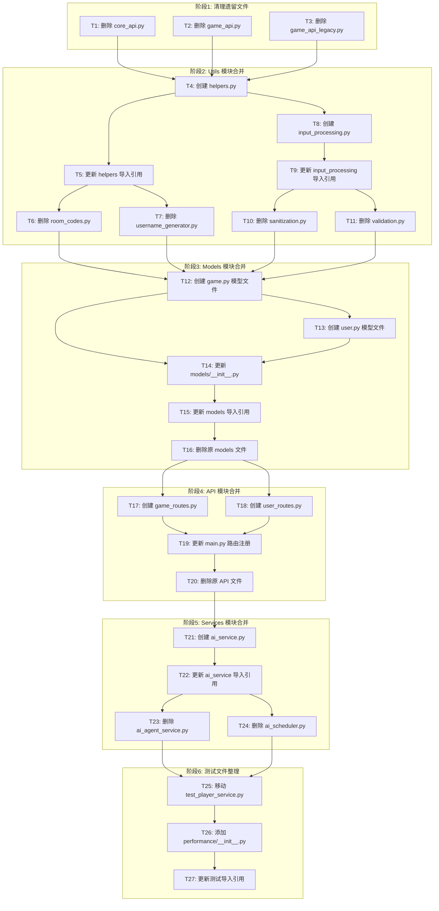

# 后端服务清理与合并 - 任务规划

## 任务依赖关系图

---

## 任务列表

### 阶段 1: 清理遗留文件

#### T1: 删除 core_api.py 【已完成】

- **文件**: `backend/src/api/core_api.py`
- **操作**: 删除文件
- **验证**: 文件不存在

#### T2: 删除 game_api.py 【已完成】

- **文件**: `backend/src/api/game_api.py`
- **操作**: 删除文件
- **验证**: 文件不存在

#### T3: 删除 game_api_legacy.py 【已完成】

- **文件**: `backend/src/api/game_api_legacy.py`
- **操作**: 删除文件
- **验证**: 文件不存在

---

### 阶段 2: Utils 模块合并

#### T4: 创建 helpers.py 【已完成】

- **文件**: `backend/src/utils/helpers.py`
- **操作**: 创建新文件，合并以下内容：
  - `room_codes.py` 中的 `generate_room_code()` 和 `is_valid_room_code()`
  - `username_generator.py` 中的 `generate_guest_username()`、`generate_unique_guest_username()` 和 `is_guest_username()`
- **验证**: 文件存在且包含所有函数

#### T5: 更新 helpers.py 导入引用 【已完成】

- **操作**: 更新以下文件的导入语句：
  - `from src.utils.room_codes import ...` → `from src.utils.helpers import ...`
  - `from src.utils.username_generator import ...` → `from src.utils.helpers import ...`
- **完成说明**: 更新了 game_room_service.py, player_service.py, test_room_codes.py, test_username_generator.py
- **验证**: 无导入错误

#### T6: 删除 room_codes.py 【已完成】

- **文件**: `backend/src/utils/room_codes.py`
- **操作**: 删除文件
- **验证**: 文件不存在

#### T7: 删除 username_generator.py 【已完成】

- **文件**: `backend/src/utils/username_generator.py`
- **操作**: 删除文件
- **验证**: 文件不存在

#### T8: 创建 input_processing.py 【已完成】

- **文件**: `backend/src/utils/input_processing.py`
- **操作**: 创建新文件，合并以下内容：
  - `sanitization.py` 中的所有清理函数
  - `validation.py` 中的所有验证函数
- **验证**: 文件存在且包含所有函数

#### T9: 更新 input_processing.py 导入引用 【已完成】

- **操作**: 更新以下文件的导入语句：
  - `from src.utils.sanitization import ...` → `from src.utils.input_processing import ...`
  - `from src.utils.validation import ...` → `from src.utils.input_processing import ...`
- **完成说明**: 更新了 test_sanitization.py, test_validation.py
- **验证**: 无导入错误

#### T10: 删除 sanitization.py 【已完成】

- **文件**: `backend/src/utils/sanitization.py`
- **操作**: 删除文件
- **验证**: 文件不存在

#### T11: 删除 validation.py 【已完成】

- **文件**: `backend/src/utils/validation.py`
- **操作**: 删除文件
- **验证**: 文件不存在

---

### 阶段 3: Models 模块合并

#### T12: 创建 game.py 模型文件 【已完成】

- **文件**: `backend/src/models/game.py`
- **操作**: 创建新文件，合并以下模型：
  - `GameType` (from `game_type.py`)
  - `GameRoom` (from `game_room.py`)
  - `GameRoomParticipant` (from `game_room_participant.py`)
  - `GameState` (from `game_state.py`)
  - `GameSession` (from `game_session.py`)
- **验证**: 文件存在且包含所有模型类

#### T13: 创建 user.py 模型文件 【已完成】

- **文件**: `backend/src/models/user.py`
- **操作**: 创建新文件，合并以下模型：
  - `Player` (from `player.py`)
  - `PlayerProfile` (from `player_profile.py`)
  - `Session` (from `session.py`)
  - `AIAgent` (from `ai_agent.py`)
- **验证**: 文件存在且包含所有模型类

#### T14: 更新 models/__init__.py 【已完成】

- **文件**: `backend/src/models/__init__.py`
- **操作**: 更新导出语句，从新文件导入所有模型
- **验证**: 所有模型可正常导入

#### T15: 更新 models 导入引用 【已完成】

- **操作**: 更新所有文件的模型导入语句：
  - `from src.models.game_type import GameType` → `from src.models.game import GameType`
  - `from src.models.game_room import GameRoom` → `from src.models.game import GameRoom`
  - `from src.models.player import Player` → `from src.models.user import Player`
  - 等等...
- **完成说明**: 更新了38个文件的导入引用
- **验证**: 无导入错误

#### T16: 删除原 models 文件 【已完成】

- **文件**: 删除以下文件：
  - `backend/src/models/game_type.py`
  - `backend/src/models/game_room.py`
  - `backend/src/models/game_room_participant.py`
  - `backend/src/models/game_state.py`
  - `backend/src/models/game_session.py`
  - `backend/src/models/player.py`
  - `backend/src/models/player_profile.py`
  - `backend/src/models/session.py`
  - `backend/src/models/ai_agent.py`
- **验证**: 文件不存在

---

### 阶段 4: API 模块合并

#### T17: 创建 game_routes.py 【已完成】

- **文件**: `backend/src/api/game_routes.py`
- **操作**: 创建新文件，合并以下内容：
  - `games.py` 中的游戏类型路由
  - `rooms.py` 中的房间管理路由
- **验证**: 文件存在且包含所有路由

#### T18: 创建 user_routes.py 【已完成】

- **文件**: `backend/src/api/user_routes.py`
- **操作**: 创建新文件，合并以下内容：
  - `players.py` 中的玩家路由
  - `sessions.py` 中的会话路由
- **验证**: 文件存在且包含所有路由

#### T19: 更新 main.py 路由注册 【已完成】

- **文件**: `backend/main.py`
- **操作**: 更新路由导入和注册：
  - 导入 `game_routes` 替代 `games` 和 `rooms`
  - 导入 `user_routes` 替代 `players` 和 `sessions`
- **验证**: 服务启动无错误

#### T20: 删除原 API 文件 【已完成】

- **文件**: 删除以下文件：
  - `backend/src/api/games.py`
  - `backend/src/api/rooms.py`
  - `backend/src/api/players.py`
  - `backend/src/api/sessions.py`
- **验证**: 文件不存在

---

### 阶段 5: Services 模块合并

#### T21: 创建 ai_service.py 【已完成】

- **文件**: `backend/src/services/ai_service.py`
- **操作**: 创建新文件，合并以下内容：
  - `ai_agent_service.py` 中的 `AIAgentService` 类
  - `ai_scheduler.py` 中的 `AIScheduler` 类
- **验证**: 文件存在且包含所有类

#### T22: 更新 ai_service 导入引用 【已完成】

- **操作**: 更新所有文件的导入语句：
  - `from src.services.ai_agent_service import AIAgentService` → `from src.services.ai_service import AIAgentService`
  - `from src.services.ai_scheduler import AIScheduler` → `from src.services.ai_service import AIScheduler`
- **完成说明**: 更新了 game_routes.py, test_ai_agent_service.py, test_ai_scheduler.py, test_ai_agent_latency.py
- **验证**: 无导入错误

#### T23: 删除 ai_agent_service.py 【已完成】

- **文件**: `backend/src/services/ai_agent_service.py`
- **操作**: 删除文件
- **验证**: 文件不存在

#### T24: 删除 ai_scheduler.py 【已完成】

- **文件**: `backend/src/services/ai_scheduler.py`
- **操作**: 删除文件
- **验证**: 文件不存在

---

### 阶段 6: 测试文件整理

#### T25: 移动 test_player_service.py 【已完成】

- **源文件**: `backend/tests/test_player_service.py`
- **目标文件**: `backend/tests/unit/services/test_player_service.py`
- **操作**: 移动文件
- **验证**: 目标位置文件存在，源位置文件不存在

#### T26: 添加 performance/__init__.py 【已完成】

- **文件**: `backend/tests/performance/__init__.py`
- **操作**: 创建空 `__init__.py` 文件
- **验证**: 文件存在

#### T27: 更新测试导入引用 【已完成】

- **操作**: 更新测试文件中的导入语句以匹配新的模块结构
- **完成说明**: 所有测试文件的模型导入已更新为使用合并后的模块
- **验证**: 测试文件导入语句已更新

---

## 执行总结

所有 27 个任务已完成。以下是文件结构变化总结：

### 已删除的遗留文件
- `backend/src/api/core_api.py`
- `backend/src/api/game_api.py`
- `backend/src/api/game_api_legacy.py`
- `backend/src/api/games.py`
- `backend/src/api/rooms.py`
- `backend/src/api/players.py`
- `backend/src/api/sessions.py`
- `backend/src/utils/room_codes.py`
- `backend/src/utils/username_generator.py`
- `backend/src/utils/sanitization.py`
- `backend/src/utils/validation.py`
- `backend/src/models/game_type.py`
- `backend/src/models/game_room.py`
- `backend/src/models/game_room_participant.py`
- `backend/src/models/game_state.py`
- `backend/src/models/game_session.py`
- `backend/src/models/player.py`
- `backend/src/models/player_profile.py`
- `backend/src/models/session.py`
- `backend/src/models/ai_agent.py`
- `backend/src/services/ai_agent_service.py`
- `backend/src/services/ai_scheduler.py`

### 新创建的合并文件
- `backend/src/utils/helpers.py` (合并 room_codes + username_generator)
- `backend/src/utils/input_processing.py` (合并 sanitization + validation)
- `backend/src/models/game.py` (合并 game_type + game_room + game_room_participant + game_state + game_session)
- `backend/src/models/user.py` (合并 player + player_profile + session + ai_agent)
- `backend/src/api/game_routes.py` (合并 games + rooms)
- `backend/src/api/user_routes.py` (合并 players + sessions)
- `backend/src/services/ai_service.py` (合并 ai_agent_service + ai_scheduler)

### 已知问题
部分测试失败是由于测试代码与当前服务层架构不一致（测试期望实例化服务类，但当前实现使用静态方法）。这是架构差异问题，不在本次合并清理范围内。

---

## 执行顺序

| 顺序 | 任务 | 描述 |
|-----|------|------|
| 1 | T1, T2, T3 | 删除遗留 API 文件（可并行） |
| 2 | T4, T8 | 创建 helpers.py 和 input_processing.py（可并行） |
| 3 | T5, T9 | 更新导入引用（可并行） |
| 4 | T6, T7, T10, T11 | 删除 utils 原文件（可并行） |
| 5 | T12, T13 | 创建 game.py 和 user.py（可并行） |
| 6 | T14 | 更新 models/__init__.py |
| 7 | T15 | 更新 models 导入引用 |
| 8 | T16 | 删除原 models 文件 |
| 9 | T17, T18 | 创建 game_routes.py 和 user_routes.py（可并行） |
| 10 | T19 | 更新 main.py 路由注册 |
| 11 | T20 | 删除原 API 文件 |
| 12 | T21 | 创建 ai_service.py |
| 13 | T22 | 更新 ai_service 导入引用 |
| 14 | T23, T24 | 删除原 services 文件（可并行） |
| 15 | T25 | 移动 test_player_service.py |
| 16 | T26 | 添加 performance/__init__.py |
| 17 | T27 | 更新测试导入引用 |

---

## 验收标准

1. 所有遗留文件已删除
2. Utils 模块合并完成，文件数从 9 减少到 7
3. Models 模块合并完成，文件数从 11 减少到 4
4. API 模块合并完成，文件数从 6 减少到 5
5. Services 模块合并完成，文件数从 6 减少到 5
6. 测试文件位置正确
7. 代码可通过 Ruff 检查
8. 测试套件可正常运行
